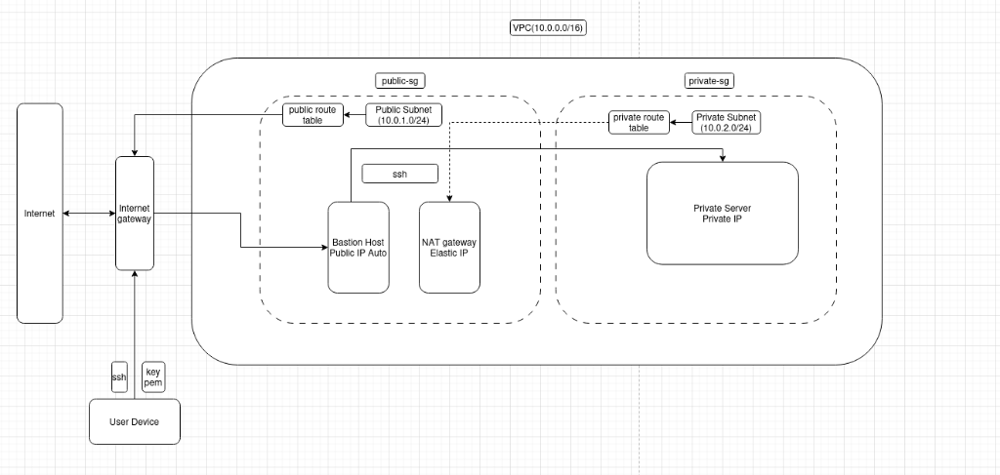

# AWS Infrastructure Deployment

Infrastructure as Code with **Terraform** or **CloudFormation** (choose one).

##  Prepare

### 1. Get your public IP
```bash
curl ifconfig.me
```
Result: `116.110.xx.xx` (example)

### 2. Create Key Pair on AWS
```bash
aws ec2 create-key-pair --key-name lab_01 --query 'KeyMaterial' --output text > <YOUR_KEY_PAIR_NAME>.pem
chmod 400 <YOUR_KEY_PAIR_NAME>.pem
```
Or create via [AWS Console](https://console.aws.amazon.com/ec2/v2/home#KeyPairs:) → Download file `.pem`

---

##  Deploy with CloudFormation

### Step 1: Update information
Edit file `cloudformation/parameters.json`:
```json
{
    "ParameterKey": "MyPublicIP",
    "ParameterValue": "116.110.40.55/32"  ← IP of you + /32
},
{
    "ParameterKey": "KeyPairName",
    "ParameterValue": "lab_01"  ← Name of key pair (without .pem)
}
```

### Step 2: Deploy
```bash
cd cloudformation
./deploy.sh
```

### Step 3: Connect
```bash
ssh -A -i <YOUR_KEY_PAIR_NAME>.pem ec2-user@<PUBLIC_IP>
```

### Delete stack
```bash
./destroy.sh
```

---

##  Deploy with Terraform

### Step 1: Move key file
```bash
cp <YOUR_KEY_PAIR_NAME>.pem terraform/
```

### Step 2: Deploy
```bash
cd terraform
terraform init
terraform plan
terraform apply
```

When asked, enter:
- **my_ip**: `116.110.xx.xx`
- **key_pair_name**: `lab_01`

### Step 3: Connect
```bash
ssh -A -i <YOUR_KEY_PAIR_NAME>.pem ec2-user@<PUBLIC_IP>
```

### Delete infrastructure
```bash 
terraform destroy
```

---

##  Architecture



**Total**: 14 AWS resources

- **VPC**: 10.0.0.0/16
- **Public Subnet**: 10.0.1.0/24 (Internet Gateway, NAT Gateway, Bastion Host)
- **Private Subnet**: 10.0.2.0/24 (App Server with Private IP only)

---

##  Check

### SSH from local → Bastion
```bash
ssh -A -i lab_01.pem ec2-user@<BASTION_PUBLIC_IP>
```

### SSH from Bastion → Private Server
```bash
ssh ec2-user@<PRIVATE_IP>
```

### Test internet from Private Server
```bash
ping google.com
```

---

##  Structure

```
.
├── terraform/              # Terraform IaC
│   ├── main.tf
│   ├── variables.tf
│   ├── terraform.tfvars
│   └── modules/
│       ├── vpc/
│       ├── security_groups/
│       └── ec2/
│
└── cloudformation/         # CloudFormation IaC
    ├── infrastructure.yaml
    ├── parameters.json
    ├── deploy.sh
    └── destroy.sh
```

---

##  Requirements

- AWS CLI configured
- Terraform (if using Terraform)
- Bash shell
- AWS credentials with EC2, VPC, CloudFormation permissions

---

